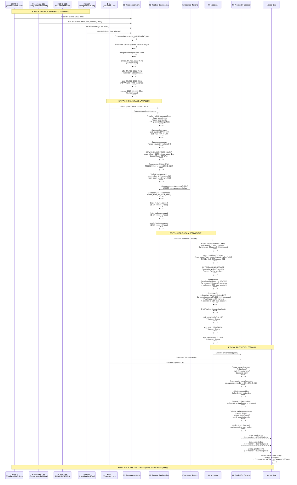
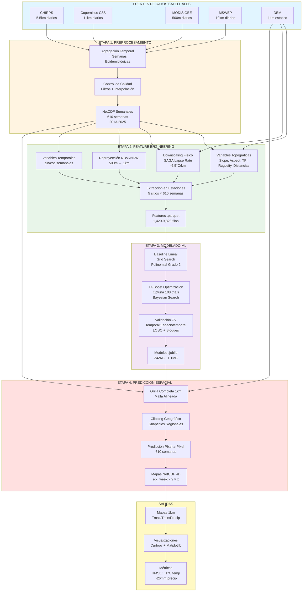
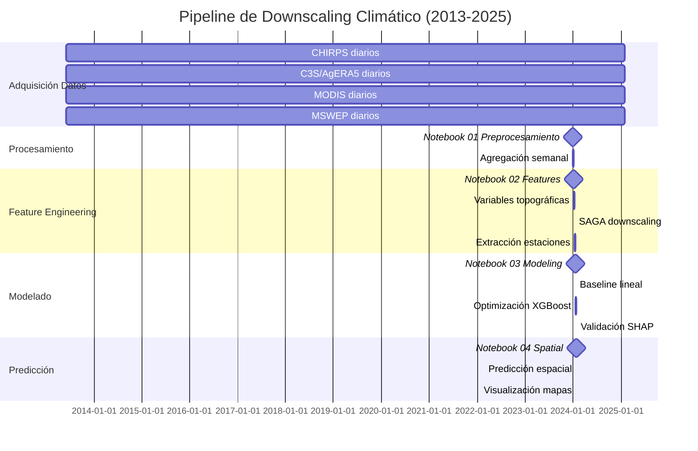
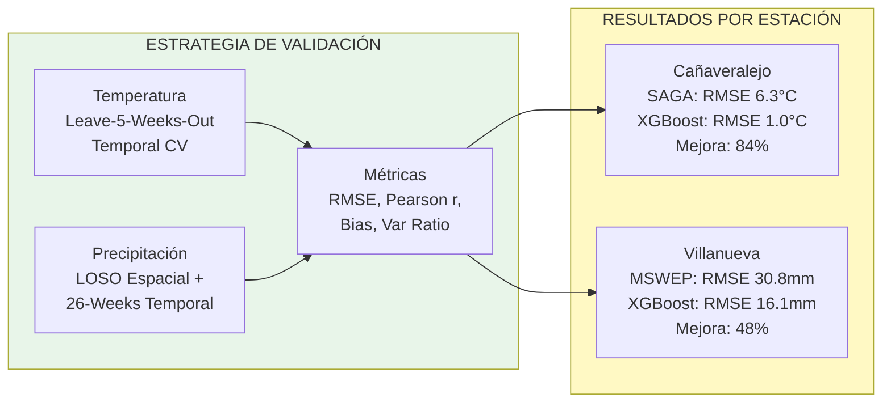

# Sistema de Downscaling Climático - Diagrama de Secuencia

## Flujo Completo del Sistema



---

## Diagrama de Flujo de Datos (Simplificado)



---

## Arquitectura de Modelos XGBoost

```mermaid
graph TD
    subgraph Temperatura["MODELO TEMPERATURA (Tmax/Tmin)"]
        T1[Features: 7 variables<br/>aspect, ndvi, slope,<br/>tmax_saga, tmin_saga,<br/>valle, week_sin]
        T2[XGBoost Regressor<br/>n_estimators: 259<br/>max_depth: 3<br/>learning_rate: 0.034]
        T3[Sample Weighting<br/>w = 1 + ((T-μ)/σ)²]
        T4[CV Temporal<br/>Bloques 5 semanas]
        T5[Output: Tmax/Tmin 1km<br/>RMSE: ~1°C<br/>Pearson: 0.91]

        T1 --> T2
        T3 --> T2
        T2 --> T4
        T4 --> T5
    end

    subgraph Precipitacion["MODELO PRECIPITACIÓN"]
        P1[Features: 8 variables<br/>Latitud, mswep_1km,<br/>mswep_dem, ndvi, ndwi,<br/>tmax_saga, tmin_saga, week_sin]
        P2[XGBoost Tweedie<br/>n_estimators: 517<br/>max_depth: 5<br/>learning_rate: 0.048<br/>tweedie_variance: 1.87]
        P3[CV Espaciotemporal<br/>LOSO + Bloques 26 semanas<br/>Paralelo: 56 workers]
        P4[Output: Precipitación 1km<br/>RMSE: ~26mm<br/>Pearson: 0.77]

        P1 --> P2
        P2 --> P3
        P3 --> P4
    end

    style Temperatura fill:#ffebee
    style Precipitacion fill:#e3f2fd
```

---

## Cronología del Pipeline



---

## Métricas de Validación



